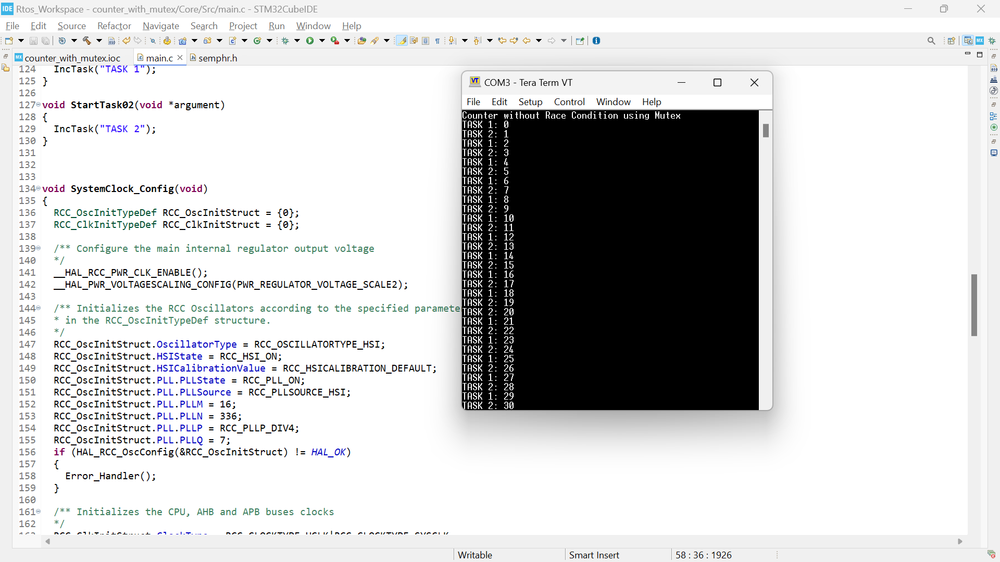

# Counter With Mutex – FreeRTOS Example (STM32)

This project demonstrates the **solution to race conditions** in FreeRTOS by using a **mutex** to protect shared resources.

## 📝 Description
- Two tasks (`TASK 1` and `TASK 2`) increment a global counter.  
- A **mutex** is used to ensure that **only one task** can update the counter at a time.  
- This eliminates race conditions and produces **sequential, predictable output**.  

## ⚡ Hardware & Tools
- STM32 Nucleo board (tested on STM32F4xx)  
- STM32CubeIDE with CMSIS-RTOS v2  
- UART (115200 baud) for logging  

## 🚀 Expected Behavior
- Counter values increment **cleanly from 0 → 100** without overlap.  
- Both tasks take turns, ensuring data consistency.  

## 📸 Output

## 📚 Key Learning
- Use **mutexes** to protect shared resources in RTOS-based applications.  
- Proper synchronization ensures **reliable, deterministic behavior**.
